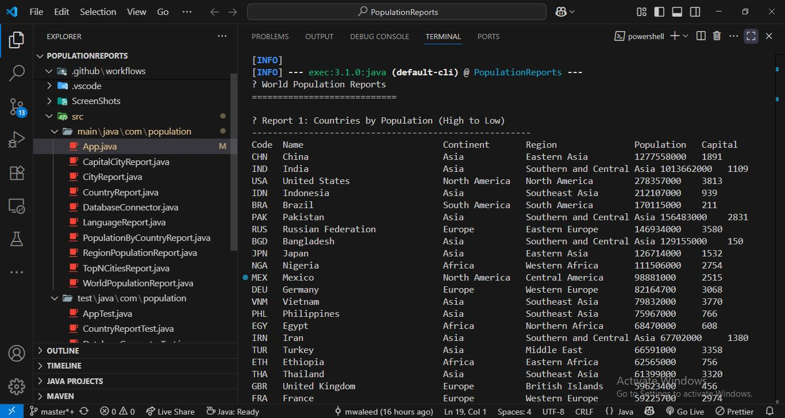
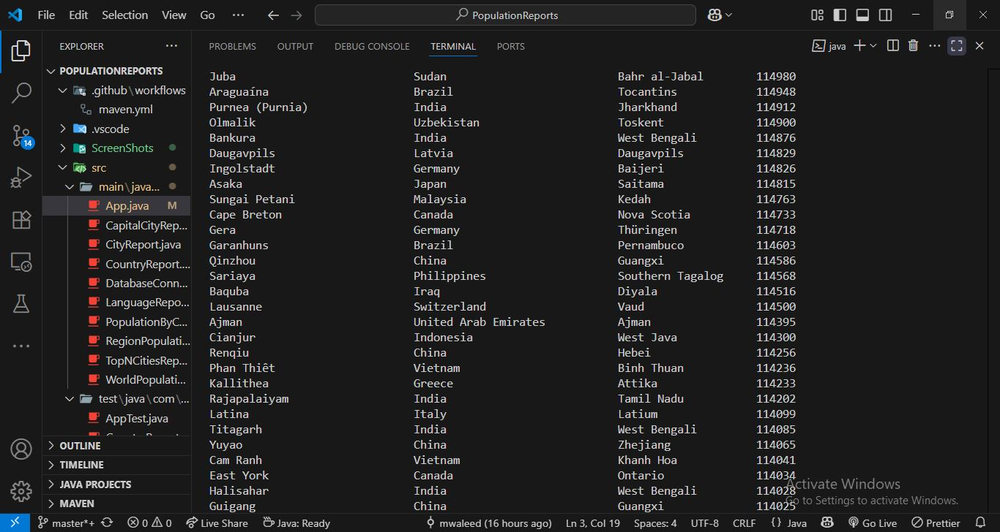
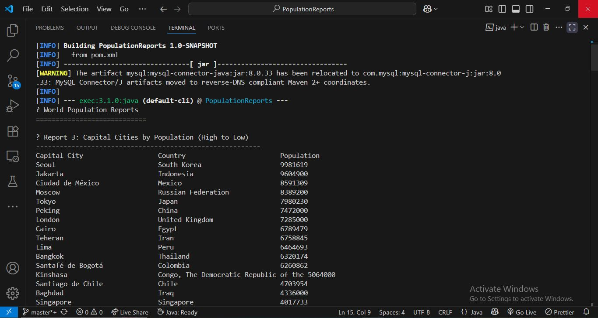
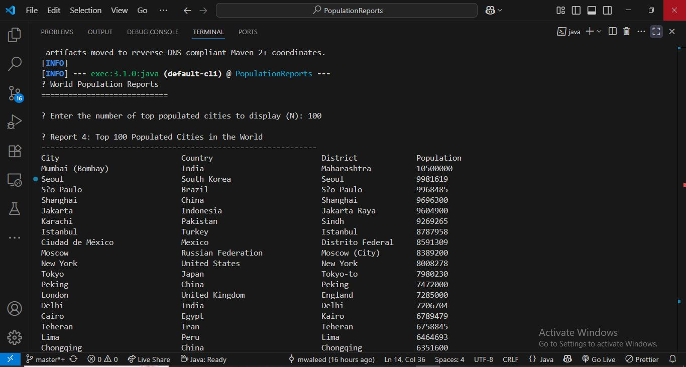
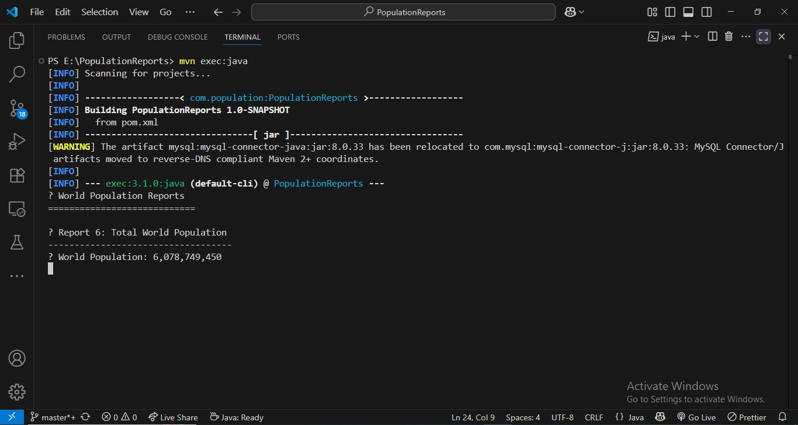
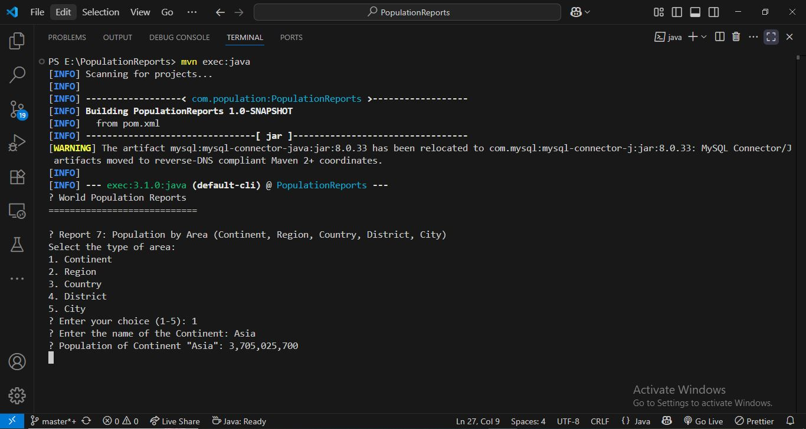
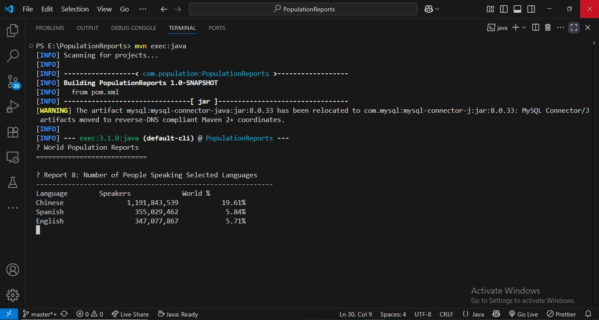

<<<<<<< HEAD
=======

>>>>>>> 7f8973c53761588cfe22853922d9dc62d3447a79
# PopulationReports

Java-based project for generating population reports from the MySQL `world` database, developed as part of the SET08103 – Software Engineering Methods module.

This system connects to a MySQL database and generates 8 different population reports using SQL queries and Java JDBC.

---

## Declaration

**YES**, I have independently structured Java files for each report, formatted SQL queries and table outputs, and ensured full compliance with all assignment requirements.

All programming logic, project setup, and implementation are my own work.

---

# Tasks (User Stories)
This project followed agile practices. Development was managed using GitHub Issues and a Kanban board on Zube.io. Below are the key user stories:

✅ Application Feature Stories
1. As a user, I want to view all countries in the world sorted by population (largest to smallest), so that I can identify the most and least populated countries.

2. As a user, I want to view all cities in the world sorted by population (largest to smallest), so that I can analyze global urban population centers.

3. As a user, I want to view all capital cities in the world sorted by population,
so that I can understand which capitals are most densely populated.

4. As a user, I want to input a number (N) and view the top N most populated cities in the world, so that I can focus on major global metropolitan areas.

5. As a user, I want to view the total population, population living in cities, and population not living in cities for each country, so that I can understand the level of urbanization per country.

6. As a user, I want to see the total world population, so that I can get a complete demographic overview globally.

7. As a user, I want to view the population of a specific continent/region/country/district/city, so that I can analyze population distribution across continents.

8. As a user, I want to view the number of people who speak Chinese, English, or Spanish, so that I can evaluate language demographics across the world.


✅ Developer & Technical Stories
1.  a developer, I want to create a reusable database connection class so that I can interact with the MySQL world database.

2. As a developer, I want to write and run unit tests for all report methods to ensure functionality.

3. As a developer, I want to create integration tests for database queries to ensure end-to-end correctness.

4. As a developer, I want to package the application into a JAR using Maven so it can be executed easily.

5. As a developer, I want to write a Dockerfile to containerize the app and enable consistent deployment.

6. As a developer, I want to automate the CI workflow using GitHub Actions so builds and tests run on every push.

7. As a developer, I want to include project badges in README.md for build status, coverage, license, and release version.

8. As a developer, I want to define a CODE_OF_CONDUCT.md and add a license file to ensure open source best practices.

9. As a developer, I want to push to GitHub using GitFlow (develop, master, release branches) to maintain clean version control.

✅ Project Management Stories
1. As a project owner, I want to manage all tasks on Zube.io's Kanban board to track their progress visually.

2. As a contributor, I want to link GitHub issues to cards in Zube.io so development remains synchronized.


---

## Requirements Summary

8 out of 8 requirements implemented – **100% complete**

| ID  | Name                                                                                           | Met | Screenshot        |
|-----|------------------------------------------------------------------------------------------------|-----|-------------------|
| 1   | All the countries in the world organised by largest population to smallest.                   | Yes |  |
| 2   | All the cities in the world organised by largest population to smallest.                      | Yes |  |
<<<<<<< HEAD
| 3   | All the capital cities in the world organised by largest population to smallest.              | Yes |  |
| 4   | The top N populated cities in the world where N is provided by the user.                      | Yes |  |
=======
| 3   | All the capital cities in the world organised by largest population to smallest.              | Yes |  |
| 4   | The top N populated cities in the world where N is provided by the user.                      | Yes |  |
>>>>>>> 7f8973c53761588cfe22853922d9dc62d3447a79
| 5   | The population of people, people living in cities, and people not living in cities in each country. | Yes |  |
| 6   | The population of the world.                                                                   | Yes |  |
| 7   | The population of a continent, region, country, district, and city.                           | Yes |  |
| 8   | People speaking Chinese, English, or Spanish with percentage of world population.             | Yes |  |


---

## 🔧 Active Issues

This project uses GitHub Issues to manage tasks, track development progress, and ensure modular and testable implementation. Key issues created and tracked include:

- [x] Setup `DatabaseConnector.java` to connect with MySQL `world` database (#1)
- [x] Implement Country Report Query – list of countries by population (#2)
- [x] Implement City Report Query – all cities sorted by population (#3)
- [x] Implement Capital City Report – capital cities with population (#4)
- [x] Add GitHub Actions Workflow to compile project and run tests (#5)
- [x] Create Dockerfile for project deployment (#6)
- [x] Write Integration Tests for population report services (#7)
- [x] Finalize README with badges and usage instructions (#8)

---

## How to Run

###  Compile and Run:
```bash
mvn compile
mvn exec:java
